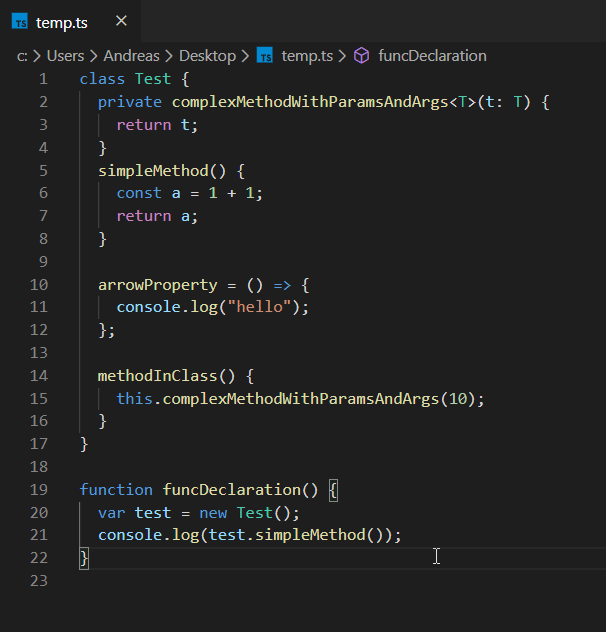

# RefactorThis extension for Visual Studio Code

A vscode extension for TypeScript files that offers refactoring options that I felt was missing.

## Features

A number of refactoring options will be offered via the vscode quick fix lightbulb feature, and available as commands if you wish to keybind stuff.
See below for a complete listing, expand each one for demo.

  
Convert to arrow syntax (=>)

## Known Issues

-

## Release Notes

### 1.0.0

Initial release. Contains one refactoring, "Convert to arrow syntax (=>)"
